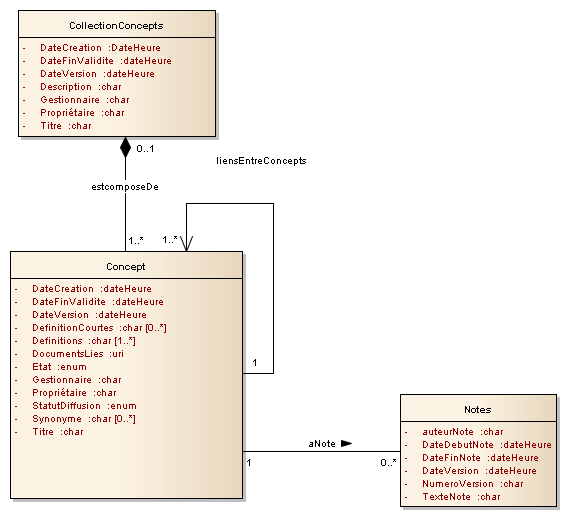

# Concepts

Le référentiel des concepts est au format [RDF](http://www.w3.org/RDF/). La description des concepts se fait à l'aide des vocabulaires adaptés, et en particulier suit la recommandation [SKOS](http://www.w3.org/2004/02/skos/) du W3C.

Les tableaux suivants illustrent la façon dont est implémentée en RDF le diagramme de classe des concepts. Pour chaque classe, on trouve les différents liens entre objets puis les attributs des classes. La colonne « relations sémantiques » indique précisément l'attribut RDF utilisé :

* Le premier terme est un raccourci pour désigner le vocabulaire utilisé \(ex : skos, cf. liste des vocabulaires\)
* une propriété de cet objet \(ex : skos:prefLabel\). 

Pour les cardinalités associées à certains attributs, se référer au diagramme de classes.

### Liste des vocabulaires utilisés

dc [http://purl.org/dc/elements/1.1/](http://purl.org/dc/elements/1.1/) 

dcterms [http://purl.org/dc/terms/](http://purl.org/dc/terms/) 

skos [http://www.w3.org/2004/02/skos/core\#](http://www.w3.org/2004/02/skos/core#) 

pav [http://purl.org/pav/](http://purl.org/pav/)

insee [http://rdf.insee.fr/def/base\#](http://rdf.insee.fr/def/base#) 

xkos [http://rdf-vocabulary.ddialliance.org/xkos\#](http://rdf-vocabulary.ddialliance.org/xkos#)

## Description des classes

### Collection Concepts {#Collection}

| Proprieté | Relation sémantique | Objet | Description |
| :--- | :--- | :--- | :--- |
| Type | rdf:type | skos:Collection | Collection de concepts identifiée de manière unique par son URI |
| DateCreation | dcterms:created | date |  |
| DateFinValidite | dcterms:valid | date |  |
| DateVersion | dcterms:modified | date | Date de dernière modification effectuée |
| Description | dcterms:description |  | Sert à préciser l'objectif de la collection |
| Gestionnaire | dc:contributor |  | Entité responsable des contributions sur la ressource. |
| Proprietaire | dc:creator |  | Propriétaire \(au sein de l'organisme\) ; entité responsable de la création de la ressource |
| Titre | dcterms:title |  |  |
| StatutValidation | insee:isValidated | « Provisoire » ou « Validé » |  |
| ComposeDe | skos:member | Concept | ensemble des concepts contenus dans la collection |

### Concept Scheme

| Proprieté | Relation sémantique | Objet | Description |
| :--- | :--- | :--- | :--- |
| Type | rdf:type | skos:ConceptScheme |  |
| Responsable légal | dcterms:publisher | "INSEE" |  |
| Titre | dcterms:title | "Base de définitions de l'INSEE"@fr |  |
| Label | skos:prefLabel | "Base de définitions de l'INSEE"@fr |  |
| Date de mise à jour | pav:lastRefreshedOn | date | Date de dernière mise à jour des concepts \( = max \(dcterms:modified\) \) |

### Concept  {#Concept}

| Proprieté | Relation sémantique | Objet | Description |
| :--- | :--- | :--- | :--- |
| Scheme | skos:inScheme | ConceptScheme |  |
|  | skos:topConceptOf |  | Caractérise les concepts de premier niveau dans le concept scheme |
| A pour parent | skos:broader | Concept | Lien ascendant\(hiérarchique\) avec UN concept |
| A pour enfant | skos:narrower | Concept | Lien descendant\(hiérarchique\) avec un ou plusieurs \(autres\) concepts |
| Reference | dcterms:references | Concept | Lien entre un concept et les concepts cités dans la définition |
| Lié à | skos:related | Concept | Lien avec un ou plusieurs autre\(s\) concepts, autre que ceux déjà définis |
| Remplace | dcterms:replaces | Concept | Lien avec le\(s\) concept\(s\) qui a été supplanté par le concept courant |
| Type | rdf:type | skos:Concept |  |
| Identifiant | skos:notation | Suit la regex « c\[1-9\]{1}\[0-9\]{3} » Exemple : c1453 | Identifiant du concept |
| DateCreation | dcterms:created | date | Date de création du concept |
| DateFinValidite | dcterms:valid | date | Date de fin de validité du concept. Un concept qui n'est plus valide a une date de fin de validité renseignée, mais doit être conservé dans le référentiel et rester accessible à partir des liens posés sur les produits et publications y faisant référence. |
| DateVersion | dcterms:modified | date | Date de version : i.e dernière modification du concept \(cf version\) |
| Definition | skos:definition | ExplanatoryNote \(cf. classe Note\) | Définition longue du concept |
| DefinitionCourte | skos:scopeNote | ExplanatoryNote \(cf. classe Note\) | Définition courte du concept |
| DocumentLie | insee:additionnalMaterial | URL du document lié |  |
| Etat | insee:isValidated | Trois modalités possibles :  - Provisoire - Validé - Publié | Attribut de gestion utilisé lors du processus de validation \(non exporté en diffusion\) |
| Gestionnaire | dc:contributor |  | Entité responsable des contributions sur la ressource. |
| NoteChangement | skos:changeNote | ExplanatoryNote \(cf. classe Note\) | Remarques internes sur le concept |
| NotePubliable | skos:editorialNote | ExplanatoryNote \(cf. classe Note\) | Remarques publiques sur le concept |
| NumeroVersion | pav:version | Version du concept. Format : 1, 2, etc. | Une nouvelle version du concept correspond à une modification de la rédaction  de la définition, des synonymes ou des notes \(et PJ\) Remarque :  en cas de modification « majeure » d'un concept, un nouveau concept \(qui remplace l'ancien\) sera  créé. \(voir dcterms:replaces\) |
| Proprietaire | dc:creator |  | Propriétaire \(au sein de l'organisme\) ; entité responsable de la création de la ressource. |
| StatutDiffusion | insee:disseminationStatus | Privé PublicSpecifique PublicGenerique |  |
| Synonyme | skos:altLabel |  | Libellé alternatif, sigle |
| Titre | skos:prefLabel |  | Intitulé du concept |

### Note

| Proprieté | Relation sémantique | Objet | Description |
| :--- | :--- | :--- | :--- |
| Identifiant \(cf lignes suivantes selon le type de note\) | rdf:type | xkos:ExplanatoryNote |  |
| AuteurNote | dcterms:contributor |  |  |
| Date | dcterms:issued |  | Date de publication d'une changeNote – Applicable aux objets \(instance de xkos:ExplanatoryNote\) des prédicats skos:changeNote \(datée, mais non versionnée\) |
| NumeroVersion | pav:version |  | Applicable aux objets \(instance de xkos:ExplanatoryNote\) des prédicats skos:scopeNote, skos:definition, xkos:exclusionNote |
| TexteNote | xkos:plainText | Contenu de la note \(texte brut\) |  |
| Version | Insee:conceptVersion | Version du concept à laquelle la note se rattache |  |
| Langue | Dctermes:language | Fr ou en |  |
| TexteNote | Evoc:noteLiteral | Contenu de la note en xhtml |  |

